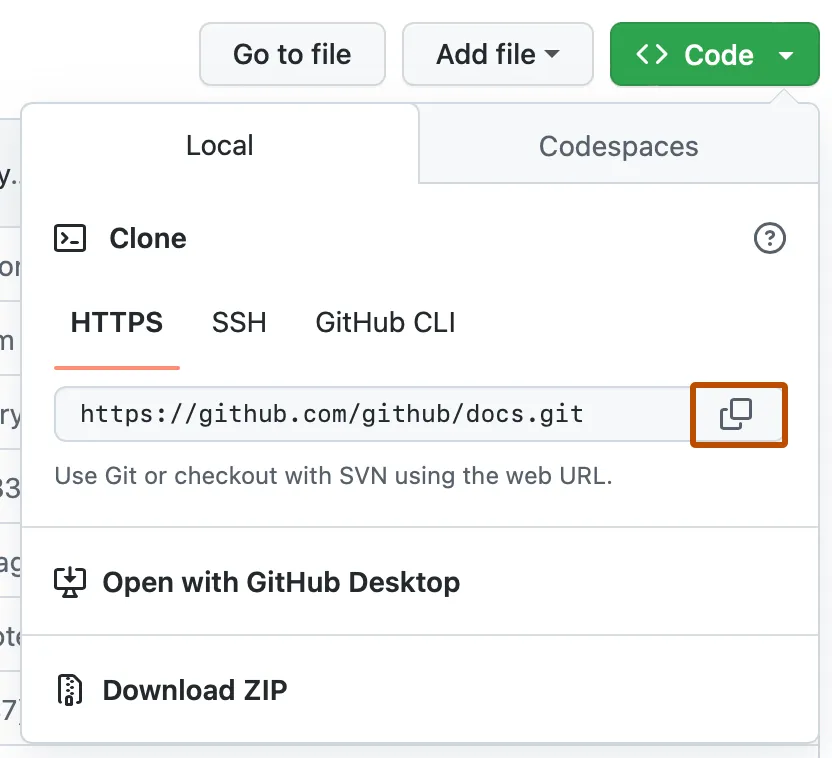

# Find 1st unique symbol

## Table of Contents

- [About](#about)
- [Getting Started](#getting_started)
- [Usage](#usage)

## About 

The program takes an arbitrary text as input and finds in each word of this text the very first symbol that is NOT repeated in the analyzed word. Next, from the received set of characters, the program selects the first unique character (that is, the one that no longer occurs in the set) and returns it as a result.

Explanation of the code:

     The find_unique_character function takes text as an input parameter.
     The character_count dictionary is created, where the keys are characters, and the values are the number of their occurrences in the text.
     In the first cycle, we go through each word in the text and count the number of occurrences of each character using the character_count dictionary.
     In the second cycle, we again go through each word in the text and check which symbols occur only once. The first of these characters is returned as the result of the function.
     If there is no unique character, None is returned.
     In the usage example, the user enters text, and then the first unique character is displayed, or a message that it is missing.

## Getting Started 

These instructions will get you a copy of the project up and running on your local machine for development and testing purposes. See [deployment](#deployment) for notes on how to deploy the project on a live system.

How to clone this repository?

    1. On GitHub.com, go to the main page of the repository.
    2. Above the list of files, click Code.
    
    3. Copy the repository URL.
    To clone the repository using the HTTPS protocol, in the "HTTPS" section, click button.
    
    4. Open GIT Bash.
    5. Change the current working directory to the location where the cloned directory should be located.
    6. Type git clone and paste the URL copied earlier.
    (https://github.com/AlexandroFSD/find_unique_character.git)
    7. Press the ENTER key

### Prerequisites

What things you need to install the software and how to install them.

To run our script_find_uniq.py we will need to install Python version 3.11

### Installing

A step by step series of examples that tell you how to get a development env running.

How to install Python in Windows?

    1. Go to  Python official site https://www.python.org/downloads/windows/
    2. Select Version of Python to Install for your version of Windows
    3. Download Python Executable Installer
    4. Run Executable Installer
    
    5. Verify Python is installed on Windows
    To ensure if Python is succesfully installed on your system. Follow the given steps −

        Open the command prompt.

        Type ‘python’ and press enter.

        The version of the python which you have installed will be displayed if the python is successfully installed on your windows.

How to install Python in Linux?

    The process of installing Python on a Linux operating system is a bit different than the processes for Windows and Mac OSes. Many Linux distributions come with Python pre-installed, but it might not be the latest version.

    To install or update Python on your Linux machine, follow these steps:

        1. Check for pre-installed Python
            Open a terminal window and type the following command to check if Python is already installed on your system:
            python --version
            Press Enter, and if Python is installed, you’ll see the version number displayed (just as we discussed for Windows and macOS. If you’re satisfied with the installed version, you can skip the remaining steps. If Python is not installed or you want to install a newer version, proceed to the next step.
        2. Install via Package Manager
            The easiest way to install Python on Linux is through the Package Manager specific to your distribution. Here are a couple of popular commands:
            sudo apt-get install python3
            Run the appropriate command for your distribution and enter your password when prompted. The Package Manager will download and install the latest version of Python 3 available in the repositories.
        3. Download the latest version of Python
            Go to the Python website and download the newest version of Python for Linux from their website.
            Extract the contents of the tarball.
        4. Compile from source (optional)
            If you prefer to compile Python from the source code, you can do so by first grabbing the latest Python source code from the official Python Git repository.
            You’ll be cloning the source from GitHub with the following code:
            git clone https://github.com/python/cpython
            From there, navigate to the extracted directory using cd cpython.
        5. Configure the script and complete the build process
            Your next order of business is to run the following code:
            ./configure
            make
            make test
            sudo make install
            Note: Compiling from source is an advanced option and may require additional dependencies and configuration. We recommend using the Package Manager method for most users.
        6. Verify installation
            After installing Python, you can verify the installation by opening a terminal window and typing the following command:
            python3 --version
            Press Enter, and you should see the version of Python you installed displayed.
            You’re now done with the installation process.

## Usage 

The simplest and most practical way to run scripts for Windows is to use the "python3" command. You need to open the command line and write "python3 script_name". (python3 script_find_uniq.py) It is important that the script is located either in the directory from which the command line is launched, or in the directory specified in the PATH environment variable. Then the launch will be successful.

In Linux, you can also use this method, but at the beginning of the Python script, the full path to the interpreter must be specified in the first line:
#!/usr/bin/python3
or
#!/usr/bin/env python3
After that, you need to allow the file to run (make it executable).
chmod u+x script_find_uniq.py
Now it is enough to simply run the script by entering your name in the terminal, before which you add "./":
./script_find_uniq.py
